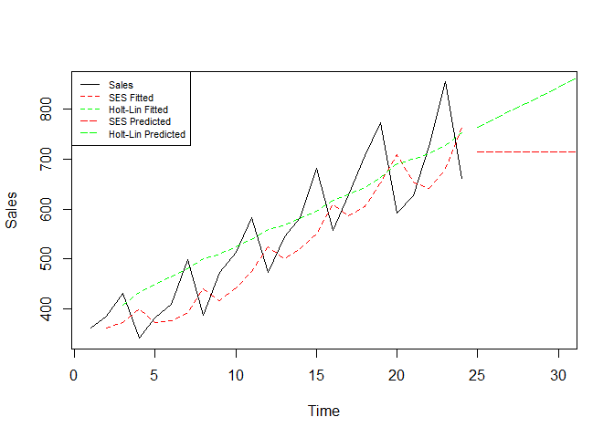

# Purpose

The purpose of this project is to practice how to make a personal
project and then commit and push it onto Github. Purely for enrichment
and honing the skills to work dynamically with R and cloud code storing.

In this particular exercise, I will be using Quarterly sales data to fit
two model: – 1: SES model – 2: Holt Linear Model Then obtain each models
Means Error(ME), Mean Average Error(MAE), Mean Average Prediction
Error(MAPE), Mean Square Error(MSE) and their Theil’s U statistics.
Lastly I will plot the models together with their forecasts.

``` r
rm(list = ls()) # Clean your environment:
gc() # garbage collection - It can be useful to call gc after a large object has been removed, as this may prompt R to return memory to the operating system.
```

    ##           used (Mb) gc trigger (Mb) max used (Mb)
    ## Ncells  531922 28.5    1189575 63.6   660402 35.3
    ## Vcells 1007599  7.7    8388608 64.0  1769646 13.6

``` r
library(tidyverse)
```

    ## Warning: package 'tidyverse' was built under R version 4.3.3

    ## Warning: package 'ggplot2' was built under R version 4.3.3

    ## Warning: package 'tibble' was built under R version 4.3.3

    ## Warning: package 'tidyr' was built under R version 4.3.3

    ## Warning: package 'readr' was built under R version 4.3.3

    ## Warning: package 'purrr' was built under R version 4.3.3

    ## Warning: package 'dplyr' was built under R version 4.3.3

    ## Warning: package 'stringr' was built under R version 4.3.3

    ## Warning: package 'forcats' was built under R version 4.3.3

    ## Warning: package 'lubridate' was built under R version 4.3.3

    ## ── Attaching core tidyverse packages ──────────────────────── tidyverse 2.0.0 ──
    ## ✔ dplyr     1.1.4     ✔ readr     2.1.5
    ## ✔ forcats   1.0.0     ✔ stringr   1.5.1
    ## ✔ ggplot2   3.5.0     ✔ tibble    3.2.1
    ## ✔ lubridate 1.9.3     ✔ tidyr     1.3.1
    ## ✔ purrr     1.0.2     
    ## ── Conflicts ────────────────────────────────────────── tidyverse_conflicts() ──
    ## ✖ dplyr::filter() masks stats::filter()
    ## ✖ dplyr::lag()    masks stats::lag()
    ## ℹ Use the conflicted package (<http://conflicted.r-lib.org/>) to force all conflicts to become errors

``` r
list.files('code/', full.names = T, recursive = T) %>% .[grepl('.R', .)] %>% as.list() %>% walk(~source(.))
library(readxl)
```

    ## Warning: package 'readxl' was built under R version 4.3.3

# Loading the Data

``` r
Quarter_sales_data <- read_excel("data/Quarter sales data.xlsx")
sales <- Quarter_sales_data[,-1]
head(Quarter_sales_data)
```

    ## # A tibble: 6 × 2
    ##     Obs Sales
    ##   <dbl> <dbl>
    ## 1     1   362
    ## 2     2   385
    ## 3     3   432
    ## 4     4   341
    ## 5     5   382
    ## 6     6   409

# Simple Exponential Smoothing (SES) Method

Without taking into account that we don’t know the clear trends and
seasonality of the sales data, the SES will be the first model we fit.

``` r
# Fitting the SES
SES.Sales<-HoltWinters(ts(sales), beta=FALSE,gamma=FALSE)
SES.Sales
```

    ## Holt-Winters exponential smoothing without trend and without seasonal component.
    ## 
    ## Call:
    ## HoltWinters(x = ts(sales), beta = FALSE, gamma = FALSE)
    ## 
    ## Smoothing parameters:
    ##  alpha: 0.4642518
    ##  beta : FALSE
    ##  gamma: FALSE
    ## 
    ## Coefficients:
    ##       [,1]
    ## a 714.5597

``` r
SES_Ft<-SES.Sales$fitted[,1]
SES_Ft
```

    ## Time Series:
    ## Start = 2 
    ## End = 24 
    ## Frequency = 1 
    ##  [1] 362.0000 372.6778 400.2182 372.7261 377.0315 391.8729 441.1426 416.0068
    ##  [9] 442.4660 475.2115 524.7883 501.2097 521.0752 549.3596 610.4739 585.6486
    ## [17] 605.3103 652.5199 708.4530 654.3895 641.6739 680.3582 760.9717

``` r
SES.Sales$x
```

    ## Time Series:
    ## Start = 1 
    ## End = 24 
    ## Frequency = 1 
    ##       Sales
    ##  [1,]   362
    ##  [2,]   385
    ##  [3,]   432
    ##  [4,]   341
    ##  [5,]   382
    ##  [6,]   409
    ##  [7,]   498
    ##  [8,]   387
    ##  [9,]   473
    ## [10,]   513
    ## [11,]   582
    ## [12,]   474
    ## [13,]   544
    ## [14,]   582
    ## [15,]   681
    ## [16,]   557
    ## [17,]   628
    ## [18,]   707
    ## [19,]   773
    ## [20,]   592
    ## [21,]   627
    ## [22,]   725
    ## [23,]   854
    ## [24,]   661

``` r
error <- sales[2:24,] -as.numeric(SES_Ft)

#--------------------------------------------------------------------
E <- SES.Sales$x - SES.Sales$fitted[,1]

# Calculating Model statitics
ME_ses = mean(E[9:23,])
MAE_ses <- mean(abs(E[9:23,]))
MAPE_ses <- mean(abs(E[9:23,]/ SES.Sales$x[10:24,] )) * 100
MSE_ses <- mean(E[9:23,]^2)

A <- sum((SES_Ft[8:23]- SES.Sales$x[9:24,]/SES.Sales$x[9:24,])^2)
B <- sum((SES.Sales$x[10:24,]-SES.Sales$x[9:23,]/SES.Sales$x[9:23,])^2)

U_SES  <- sqrt(A/B)


Performance_SES <- data.frame("ME"=ME_ses, "MAE"= MAE_ses, "MAPE"= MAPE_ses,
                               "MSE"= MSE_ses, "Theil-U"= U_SES)

Performance_SES
```

    ##         ME     MAE     MAPE      MSE   Theil.U
    ## 1 39.07271 85.4829 13.18536 8849.347 0.9519815

``` r
Forecast_ses <- predict(SES.Sales,n.ahead = 8)
```

# Holt- Linear Method

``` r
Holt.Lin.Sales <- HoltWinters(ts(sales),gamma=FALSE)
Holt.Lin.Sales
```

    ## Holt-Winters exponential smoothing with trend and without seasonal component.
    ## 
    ## Call:
    ## HoltWinters(x = ts(sales), gamma = FALSE)
    ## 
    ## Smoothing parameters:
    ##  alpha: 0.06464507
    ##  beta : 0.3333522
    ##  gamma: FALSE
    ## 
    ## Coefficients:
    ##        [,1]
    ## a 747.06335
    ## b  16.16122

``` r
Holy_Ft<-Holt.Lin.Sales$fitted[,1]
Holt.Lin.Sales$x
```

    ## Time Series:
    ## Start = 1 
    ## End = 24 
    ## Frequency = 1 
    ##       Sales
    ##  [1,]   362
    ##  [2,]   385
    ##  [3,]   432
    ##  [4,]   341
    ##  [5,]   382
    ##  [6,]   409
    ##  [7,]   498
    ##  [8,]   387
    ##  [9,]   473
    ## [10,]   513
    ## [11,]   582
    ## [12,]   474
    ## [13,]   544
    ## [14,]   582
    ## [15,]   681
    ## [16,]   557
    ## [17,]   628
    ## [18,]   707
    ## [19,]   773
    ## [20,]   592
    ## [21,]   627
    ## [22,]   725
    ## [23,]   854
    ## [24,]   661

``` r
Error_holt <- Holt.Lin.Sales$x - Holt.Lin.Sales$fitted[,1]

ME_holt <- mean(Error_holt[8:22,])
MAE_holt <- mean(abs(Error_holt[8:22,]))
MAPE_holt <- mean(abs(Error_holt[8:22,]/ Holt.Lin.Sales$x[10:24,] )) * 100
MSE_holt <- mean(Error_holt[8:22,]^2)


A_holt <- sum((Holy_Ft[8:21]- Holt.Lin.Sales$x[10:23,]/Holt.Lin.Sales$x[9:22,])^2)

B_holt <- sum((Holt.Lin.Sales$x[10:24,]-Holt.Lin.Sales$x[9:23,]/Holt.Lin.Sales$x[9:23,])^2)

U_holt  <- sqrt(A_holt/B_holt)


Performance_Holt <- data.frame("ME"=ME_holt, "MAE"= MAE_holt, "MAPE"= MAPE_holt,
                               "MSE"= MSE_holt, "Theil-U"= U_holt)

Forecast_holt <- predict(Holt.Lin.Sales,n.ahead =  8)

Performance_Holt
```

    ##          ME      MAE     MAPE      MSE   Theil.U
    ## 1 0.3040569 59.12018 9.159633 5090.577 0.9460563

# Plotting the series and forecast: SES and Holt-Linear models

``` r
plot(ts(sales),xlim=c(1,30))
lines(SES.Sales$fitted[,1],col="red",lty=2)
lines(Holt.Lin.Sales$fitted[,1],col="green",lty=2)
lines(Forecast_ses,col ="red",lty=5)
lines(Forecast_holt,col="green", lty=5)


legend("topleft", 
       legend=c("Sales", "SES Fitted", "Holt-Lin Fitted", "SES Predicted", "Holt-Lin Predicted"), 
       col=c("black", "red", "green", "red", "green"), 
       lty=c(1, 2, 2, 5, 5), 
       cex=0.7)
```


